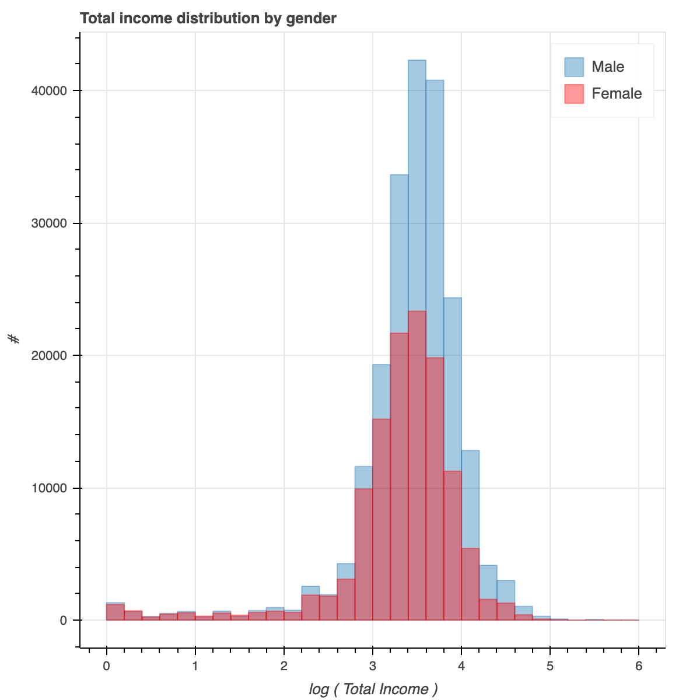

# pu

For Census data

Install with install script

```
./install.sh
```

Activate virtual env (will need to do whenever you open a new shell)

```
source venv/bin/activate
```

Run tests

```
./run_tests.sh
```

Open ipython

```
ipython
```

```
from pu.read_pandas import read_data
data = read_pandas()
```

You can stream the data like this

```
from pu.load_db import stream_data
s = stream_data()
row = next(s)
print(row)

from pu.util import get_translator, translate_record
translator = get_translator()
print(translate_record(row))

# next row, etc
row = next(s)
print(translate_record(translator, row))
```

Load the database, will take a while; maybe 10-15 min or so.
Only loads a selection of columns. If you want a smaller sample 
(say for testing), choose n_max to be some number like 1000.


```
from pu.load_db import load_data
load_table(n_max=None)
```

Now query the database

```
from pu.load_db import get_db
db = get_db()
s = db.q('pu')
# short for db.query which also works
print(translate_record(translator, row))

# get data for person number 101

s = db.q('pu', PNUM=101)
data = list(s)

print(len(data))
# result is 246834

# You have full SQL access now
sql = 'select avg(TPTOTINC) as avg_income from pu where ERACE = 1.0'
r=db.raw_sql_query(sql)
list(r)

# result is [{'avg_income': 3158.119078129321}]

sql = 'select ERACE,avg(TPTOTINC) as avg_income from pu group by ERACE'
r=db.raw_sql_query(sql)
list(r)

# result is 
# [{'ERACE': 1.0, 'avg_income': 3158.119078129321},
# {'ERACE': 2.0, 'avg_income': 2052.675778866165},
# {'ERACE': 3.0, 'avg_income': 3054.328306454251},
# {'ERACE': 4.0, 'avg_income': 1852.0821180077833}]
```

Let's do some visualizations!


Basic example of plotting a line
 
```
from bokeh.plotting import figure, show
fig=figure()
x = [1,2,3,4]
y = [5,7,9,15]
fig.circle(x, y)
fig.line(x, y, color='red')
show(fig)
```

A plot should have popped up in your browser. If you do this in a notebooks,
the figures show up in-line.

Let's plot some actual data. 
```
s=db.raw_sql_query('select TPTOTINC from pu where esex=1')
tot_income_male = [float(i['TPTOTINC']) for i in s if i['TPTOTINC'] != '']

from pu.plot_utils import add_hist_plot

fig = figure()
add_hist_plot(tot_income_male, fig)
show(fig)


from math import log10
log_income_male = [log10(i) for i in tot_income_male if i>0]
fig = figure(x_axis_label='log ( Total Income )',
             y_axis_label='#', title='Total income distribution by gender')
add_hist_plot(log_income_male, fig, n_bins=30, alpha=0.4, 
              x_range=[0,6], legend='Male')
show(fig)

s=db.raw_sql_query('select TPTOTINC from pu where esex=2')
tot_income_female = [float(i['TPTOTINC']) for i in s if i['TPTOTINC'] != '']
log_income_female = [log10(i) for i in tot_income_female if i>0]
add_hist_plot(log_income_men, fig, n_bins=30, color='red', alpha=0.4, 
              x_range=[0,6], legend='Female')
show(fig)
```

(Note this might duplicate data because each row is a (person, month) I think.)




